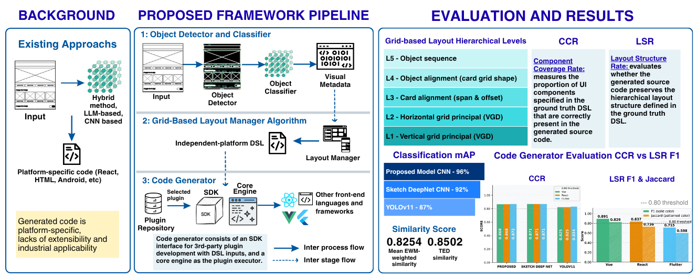

# Sketch2CodeX: An Extensible End-to-End Model-Driven Framework for Wireframe to Code Transformation

## Overview
Sketch2CodeX is technology-agnostic framework to transform UI sketch/wireframe to any front-end code framework/language by implementing plugin-architecture and intermediate grid-based layout DSL. This is my Master Thesis in Computer Science of Universitas Gadjah Mada. You can find the thesis script here: https://etd.repository.ugm.ac.id/penelitian/detail/265403 

## Directory Structure
- *object-detector* contains all code and evaluation result for object detection.
- *object-classifier* contains all code and evaluation result for UI object classification.
- *code-generator* contains core code generator and source code of SDK.
- *dataset* contains all dataset file (ground truth DSL, generated code for Flutter, VueJS3, and React Tailwind). For UI object image training and test, and sketch wireframe, you can download here: https://data.mendeley.com/datasets/nssnvc96g9/1 

## Data Availability
https://data.mendeley.com/datasets/nssnvc96g9/1 

## Classification Model
Proposed model, Sketch-DeepNet (baseline), and fine-tuned YOLOv11: https://huggingface.co/agzulvani/sketch-ui-deep-net/tree/main 